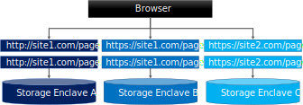

# MacFadden CSC-807 Class Project
[](https://github.com/mmacfadden/csc-807-project/actions/workflows/build.yml)

This repository hosts Michael MacFadden's Project source code for [Dakota State University's](https://dsu.edu) CSC-807 "Cyber Security Research". This README gives a brief overview of the project and the code implementation.

  * [Introduction](#introduction)
  * [Architecture](#architecture)
  * [Development](#development)
  * [Load Testing Application](#load-test-application)
  * [Demo Application](#employee-database-demo-application)

# Introduction
IndexedDB is a native NoSQL Object Store built into modern browsers.  While it is extremely popular, it does have some security challenges that stem from the fact that it does not encrypt data, does not segregate data by user, and only separates data by its Same Origin Policy.



Of particular concern are support for and/or robustness against:

  * Multi-User Access
  * Cross Site Scripting Attacks
  * Domain Name Spoofing
  * Physical Machine Compromise
  * Applications Hosted on the same domain

## Project Goals
  * Develop a framework to transparently encrypt data within IndexedDB that requires little to know changes to use compared to the standard IndexedDB API.
  * Provide a novel combination of features including:
    * Multi-User Support
    * Offline Access to Data
    * Efficient password changes
    * Support of queries on encrypted data
  * Characterize the performance impacts of encryption

# Architecture
The Encrypted IndexedDB Framework is built as a facade on top of the standard IndexedDB API and provides transparent encryption of data within IndexedDB.  The user now opens IndexedDB using a password which retrieves an protected encryption configuration.  The application then uses the Encrypted IndexedDB API as if it were the normal IndexedDB system.


## Encryption Modules
The framework provides an "Encryption Module" interface that allows multiple encryption algorithms to be implemented in the system.   An Encryption Configuration file specifies the encryption module to use and the user-specific encryption keys and/or other module parameters. An Encryption Module Factory reads the configuration and creates the appropriate configuration module.  The Encrypted IndexedDB API then delegates read / write operations to the encryption module, which in turn writes data to the underlying IndexedDB.


## Encryption Key Management
The user's password is used to derive a cryptographically strong key.  This password key is then used to encrypt the Encryption Config using AES 256.  The encryption configuration is stored in HTML5 local storage.  The encryption configuration contains randomly generated encryption keys (the data secret).  When the user logs in, their password key is derived and used to decrypt the encryption configuration.  The system then uses the data secret to initialize the encryption module to access the data.  

This means that if the user changes their password, only the encryption configuration needs to be decrypted and re-encrypted.  Since the data secret is not changed, the data does not need to be re-encrypted.


## Multi-User Data Segregation
The Encrypted IndexedDB system also injects a random, unique, namespace into each users encryption configuration.  This namespace is used to prefix all database operations including creation, opening, and closing the database.  This allows multiple users to use the same IndexedDB instance without colliding with each other.


## Data Serialization
Most encryption algorithms process either string or binary data.  JavaScript provides a native serialization format in the JavaScript Object Notation (JSON) format. However, JSON does not support all of the types that IndexedDB can store (Dates, Typed Arrays, etc.).  Thus, we chose to encode the data using the [Message Pack](https://msgpack.org/index.html) serialization implementation for JavaScript.


## Encryption Algorithms
We implemented encryption modules for 11 popular [symmetric-key encryption](https://en.wikipedia.org/wiki/Symmetric-key_algorithm) ciphers as shown below in the table:

| Chipher  | Implementation                                          |
|----------|---------------------------------------------------------|
| AES-128  | [Crypto JS](https://cryptojs.gitbook.io/docs/)          |
| AES-128  | [Node Crypto](https://nodejs.org/api/crypto.html)       |
| AES-256  | [Crypto JS](https://cryptojs.gitbook.io/docs/)          |
| AES-256  | [Node Crypto](https://nodejs.org/api/crypto.html)       |
| 3DES     | [Crypto JS](https://cryptojs.gitbook.io/docs/)          |
| Blowfish | [egoroof-blowfish](https://github.com/egoroof/blowfish) |
| Two Fish | [twofish](https://github.com/wouldgo/twofish)           |
| RC5      | [rc5](https://github.com/DeronW/rc5.js)                 |
| SM4-CBC  | [gm-crypto](https://github.com/byte-fe/gm-crypto)       |
| XSalsa20 | [tweetnacl](https://github.com/dchest/tweetnacl-js)     |
| ChaCha20 | [ts-chacha20](https://github.com/hscrypt/ts-chacha20)   |

## Load Testing
We also built an automated load testing framework that was able to generate randomized objects of a particular schema and perform many write and read operation through the Encrypted IndexedDB framework.  The load testing framework can be configured to test any number of types of ojects across any/all encryption modules and measure performance metrics including:

* Average Write Time (ms)
* Average Read Time (ms)
* Average Write Throughput (kbps)
* Average Read Throughput (kbps)


## Limitations
While this project attempted to follow sound software engineering principles and architectural design best practices, the project was most concerned with achieving the research results rather than providing a general purpose / production software system.  As such, the project has a few limitations that should be noted.

  - Indices are not currently supported.  The majority of the Index functionality has been implemented.  However,the method of extracting and encrypting the keys needs to be replicated for indices.  Indices also do not currently decrypt the data.
  - Object stores with explicit keys (e.g. no Key Path) are not currently supported.  Key's are currently extracted from the document.  It would be easy enough to encrypt the explicit keys as well. This just has not been done yet.
  - Binary keys and index values have only partial support when using the OPE Encryptor.  We are using MessagePack to serialize the data. (not this might apply to values as well).

### Bundling
The project is currently build as a single javascript bundle with all tested encryption modules included.  This means that all of the code for each module, as well as their dependencies are include in the bundle.  This creates a large JavaScript bundle of over 5MB in size.  Ideally the modules would be broken out into separate libraries that can be included individually.  Optimizing this architectural limitation was outside the research scope of this project, but would be useful for a production implementation. 

# Development
This project was developed in [Typescript](https://www.typescriptlang.org/) and cross-compiled into JavaScript for use in the browser.

## Dependencies
The following tools were used to develop this project.

  - [Node](https://nodejs.org/en/): 16.x (LTS)
  - [yarn](https://yarnpkg.com/): 1.22.x

## Building
To build the project issue the following command:

```shell
npm run build
```

The build will produce a UMD module in the [dist](dist) directory.

## Testing
The project has an extensive array of unit tests using the [Mocha](https://mochajs.org/) testing framework, augmented with the [ChaiJS Assertion Library](https://www.chaijs.com/). The project uses the [Istanbul](https://istanbul.js.org/) code coverage framework to evaluate the coverage of the unit tests.

To run the test issue the following command:
```shell
npm run test
```

Currently, the project has over 96% test coverge:

```shell

|--------------|---------|----------|---------|---------|
| File         | % Stmts | % Branch | % Funcs | % Lines |                      
|--------------|---------|----------|---------|---------|
| All files    |   96.04 |    88.21 |   93.36 |   96.06 |
|--------------|---------|----------|---------|---------|

```

# Load Test Application
We built a web application to drive the load testing framework from within the browser.  It allows the user to choose which object types and which encryption modules to test, runs the tests, and then presents the results for analysis.  The tool also allows the user to export the results in JSON and CSV formats for further analysis.


<br />


# Employee Database Demo Application
We also build a simple demonstration application that shows a example of the Encrypted Indexed DB framework supporting a real-world style application.  It demonstrates multiple users, creating/editing/deleting data, login/logout, and password changes.


<br />


